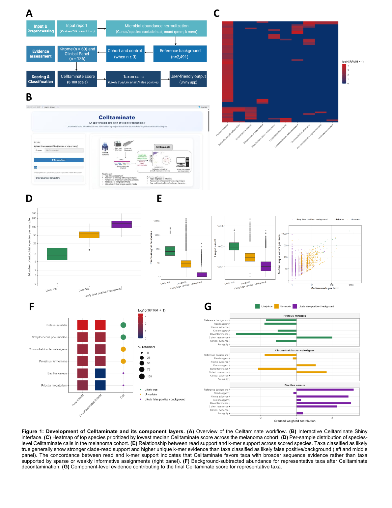

# Celltaminate


**Celltaminate** (**C**ontamination **E**valuation for **L**ow-Level **T**axon-**A**bundance in **M**icrobial **I**nference with **N**oise-**A**ware **T**riage **E**stimate) is an R-based command-line and Shiny application for contamination-aware prioritization of microbial taxa from host-dominated sequencing data.

Celltaminate starts from **Kraken2** or **KrakenUniq** taxonomic reports. It does not replace taxonomic classification. It adds a second interpretation layer that asks whether each detected microbial taxon behaves more like a sample-relevant signal or more like background, reagent, environmental, or taxonomic assignment noise.



## What Celltaminate does

Celltaminate integrates multiple evidence layers into a 0-100 score:

- read support and normalized microbial abundance;
- unique k-mer or minimizer support when available;
- reference background abundance from sterile human cell-line profiles;
- cohort recurrence and optional matched control prevalence;
- taxonomic ambiguity from the Kraken tree structure;
- curated kitome/background organisms;
- curated clinically important pathogens.

Lower Celltaminate scores indicate stronger support for a likely true microbial signal. Higher scores indicate stronger support for likely false-positive or background signal. By default, scores `<= 5` are treated as likely true, scores `>= 75` are treated as likely false positive/background, and intermediate scores are treated as uncertain.

## Quick start

Create the conda environment:

```bash
conda env create -f environment.yml
conda activate celltaminate
```

Run the bundled example:

```bash
bash examples/lung_nanopore/run_example.sh
```

Download the full reference background table from Zenodo and place it in `data/reference/`:

```bash
bin/celltaminate download-reference --out data/reference/refined_cell.lines.tsv
```

Alternatively:

```bash
mkdir -p data/reference
curl -L -o data/reference/refined_cell.lines.tsv \
  "https://zenodo.org/records/20560460/files/refined_cell.lines.tsv?download=1"
```

Run your own reports:

```bash
bin/celltaminate run \
  --reports sample1.kraken.report.txt sample2.kraken.report.txt \
  --metadata metadata.tsv \
  --outdir celltaminate_results \
  --tax-level S \
  --ref-bg-tsv data/reference/refined_cell.lines.tsv
```

Run from an input list:

```bash
bin/celltaminate run \
  --input-list input_list.txt \
  --metadata metadata.tsv \
  --outdir celltaminate_results \
  --tax-level S \
  --ref-bg-tsv data/reference/refined_cell.lines.tsv
```

Launch the Shiny app:

```bash
bin/celltaminate app
```

## Minimal metadata format

`metadata.tsv` must be tab-separated:

```text
sample	group	sample_type	is_control
S6.kraken.report.txt	full	Nanopore	FALSE
```

The `sample` value must match the Kraken report basename. For example, if the report path is `/data/S6.kraken.report.txt`, the metadata sample value should be `S6.kraken.report.txt`.

## Input files

Celltaminate accepts:

- Kraken2 6-column reports;
- Kraken2 8-column reports;
- KrakenUniq 8-column reports.

The command-line script accepts either `--input_files` or `--input_list` directly, but most users should call it through `bin/celltaminate run`.

## Output files

A standard run writes:

```text
celltaminate_results/
├── tables/
│   ├── all_taxa_table.tsv
│   ├── per_sample/
│   └── summaries/
├── plots/
├── cleaned_reports/
├── cleaned_reanalysis/
└── run_summary.tsv
```

The most important user-facing table is usually the per-sample taxa table in `tables/per_sample/`.

## Reference data

The full `refined_cell.lines.tsv` reference background table is available from Zenodo:

```text
DOI: 10.5281/zenodo.20560460
```

This repository includes `data/reference/refined_cell.lines.example.tsv`, a small example table for testing the example workflow. Real analyses should use the full Zenodo-hosted table.

## Figures

Manuscript-derived figures are included under `docs/assets/`:

- `docs/assets/figure1_celltaminate_overview.png`
- `docs/assets/figure2_benchmarking.png`
- `docs/assets/figure3_clinical_applications.png`
- `docs/assets/supplementary_figure1_scoring_details.png`

## Documentation

- [Installation](docs/installation.md)
- [Quick start](docs/quickstart.md)
- [Input formats](docs/input_formats.md)
- [Output files](docs/output_files.md)
- [Reference data](docs/reference_data.md)
- [Score interpretation](docs/scoring.md)
- [Shiny app](docs/shiny_app.md)
- [Troubleshooting](docs/troubleshooting.md)

## Citation

A formal citation should be added after the manuscript is posted or published. For now, cite the repository and manuscript as:

```text
Sirajee AS, Ghaddar B, De S. Celltaminate: A Bioinformatic Pipeline for Rapid Detection of Pathogenic Microorganisms. Manuscript in preparation.
```

## Important limitation

Celltaminate is a research software tool. It is not cleared or approved as a standalone clinical diagnostic device. Clinical interpretation should be performed by qualified personnel using validated laboratory and clinical workflows.
